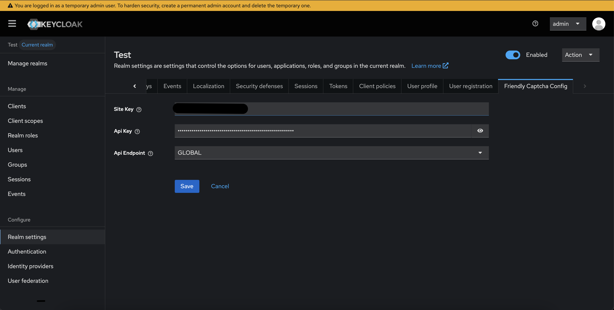
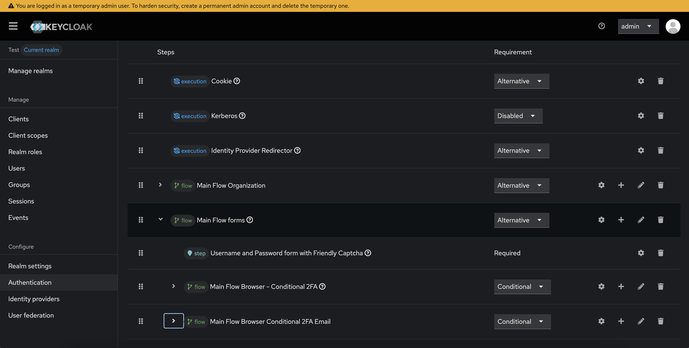
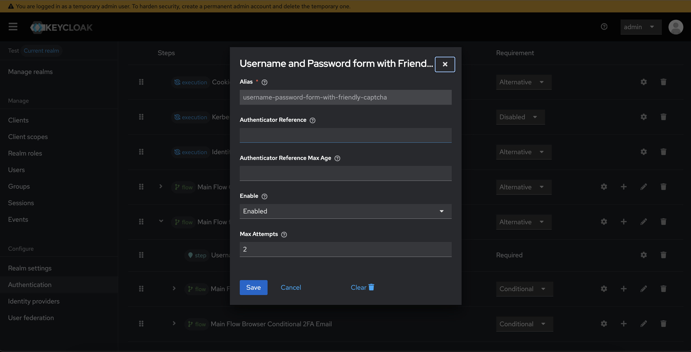
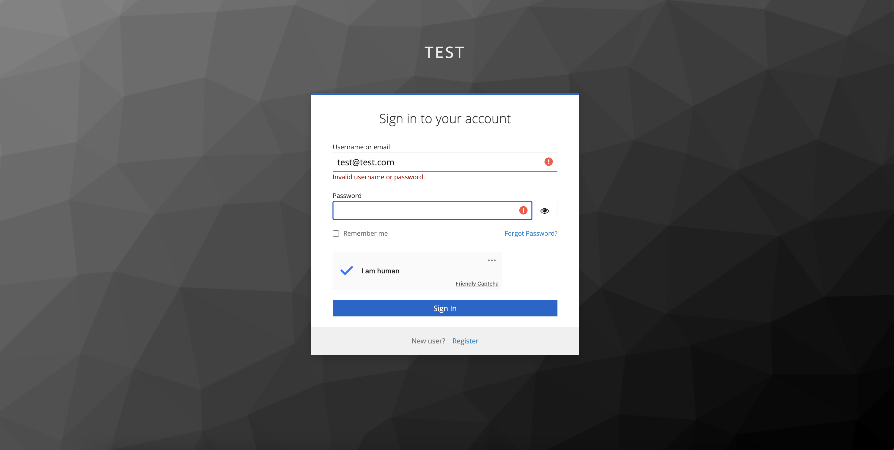
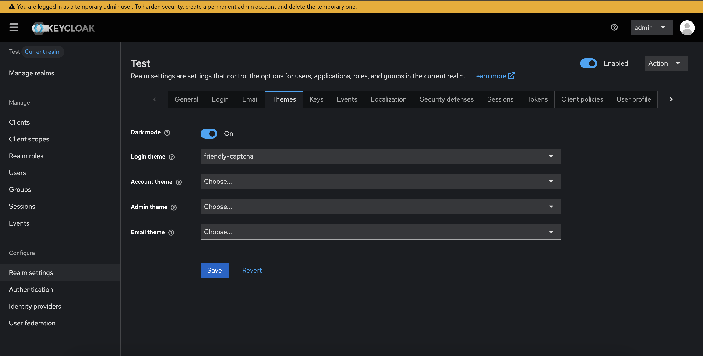

<h1 align="center">Keycloak Friendly Captcha Extension</h1>

<p align="center">
  
</p>

<p align="center">
  <strong>A privacy-friendly CAPTCHA integration for Keycloak authentication flows</strong>
</p>

> ⚠️ **BETA Notice:** This extension is currently in beta. While it is functional and tested, please use it with caution in production environments. Feedback and bug reports are welcome!

> 📢 **Disclaimer:** This is a community-developed extension and is **not officially affiliated with or endorsed by Friendly Captcha**. For official Friendly Captcha documentation and support, please visit [friendlycaptcha.com](https://friendlycaptcha.com/).

<p align="center">
  <a href="#features">Features</a> •
  <a href="#screenshots">Screenshots</a> •
  <a href="#compatibility">Compatibility</a> •
  <a href="#installation">Installation</a> •
  <a href="#configuration">Configuration</a> •
  <a href="#license">License</a>
</p>

---

## Overview

This extension integrates [Friendly Captcha](https://friendlycaptcha.com/) into Keycloak, providing a privacy-respecting, GDPR-compliant CAPTCHA solution for your authentication flows. Unlike traditional CAPTCHAs, Friendly Captcha uses proof-of-work puzzles that are solved automatically by the user's browser, eliminating the need for image recognition challenges.

## Screenshots

<details>
<summary><strong>📸 Click to view screenshots</strong></summary>

### Realm Settings - Friendly Captcha Configuration

Configure your Friendly Captcha credentials (Site Key, API Key, and Region) in the Admin Console:



### Authentication Flow Setup

Remove the default Username and Password form and replace it with the Friendly Captcha form:



### Username Password Form Configuration

Configure the Friendly Captcha authenticator settings (Enable/Disable and Max Attempts):



### Login Form with Friendly Captcha

The login form displaying the Friendly Captcha widget after the configured number of failed attempts:



### Friendly Captcha Theme

The included `friendly-captcha` theme with the CAPTCHA widget integrated:



</details>

## Features

### ✅ Currently Implemented

| Feature                             | Description                                                         |
| ----------------------------------- | ------------------------------------------------------------------- |
| **Login Form Protection**           | Username and Password form with integrated Friendly Captcha widget  |
| **Configurable Attempts Threshold** | Show CAPTCHA only after a specified number of failed login attempts |
| **Admin Console Integration**       | Configure Friendly Captcha directly from Keycloak's Realm Settings  |
| **Multi-Region Support**            | Support for both Global and EU API endpoints                        |

### 🚧 Roadmap

| Feature                      | Status  |
| ---------------------------- | ------- |
| Registration Form Protection | Planned |
| Reset Password Protection    | Planned |

## Compatibility

This extension has been tested with the following Keycloak versions:

| Keycloak Version | Status     | Notes               |
| ---------------- | ---------- | ------------------- |
| 26.4.x           | ✅ Tested  | Fully compatible    |
| 26.3.x           | 🔄 Pending | Testing in progress |

> **Note:** This extension requires Java 17 or higher and uses the `declarative-ui` feature flag.

## Installation

### Prerequisites

- Keycloak 26.x or compatible version
- Java 17+
- Maven 3.6+
- A [Friendly Captcha](https://friendlycaptcha.com/) account with Site Key and API Key

### Build & Deploy

1. **Clone the repository:**

   ```bash
   git clone https://github.com/yourusername/keycloak-friendly-captcha.git
   cd keycloak-friendly-captcha
   ```

2. **Build the extension:**

   ```bash
   mvn clean package
   ```

3. **Deploy the JAR:**

   Copy the generated JAR file to your Keycloak `providers/` directory:

   ```bash
   cp target/keycloak-friendly-captcha-0.0-SNAPSHOT.jar /path/to/keycloak/providers/
   ```

4. **Rebuild Keycloak:**

   ```bash
   bin/kc.sh build
   ```

5. **Start Keycloak with the declarative-ui feature:**

   ```bash
   bin/kc.sh start --features=declarative-ui
   ```

## Configuration

Configuration is done in two places:

1. **Realm Settings** – Global Friendly Captcha credentials (Site Key, API Key, Region)
2. **Authentication Flow** – Per-flow settings (Enable/Disable, Max Attempts)

---

### Step 1: Configure Friendly Captcha Credentials (Realm Settings)

Navigate to **Realm Settings → Friendly Captcha** tab in the Keycloak Admin Console.

| Setting          | Description                                                                                               |
| ---------------- | --------------------------------------------------------------------------------------------------------- |
| **Site Key**     | Your Friendly Captcha site key from the [Friendly Captcha Console](https://friendlycaptcha.com/dashboard) |
| **API Key**      | Your Friendly Captcha API secret key                                                                      |
| **API Endpoint** | Select `GLOBAL` or `EU` based on your data residency requirements                                         |

---

### Step 2: Configure Authentication Flow

1. Navigate to **Authentication → Flows**
2. Create a copy of the **Browser** flow (or use an existing custom flow)
3. Replace the default **Username Password Form** with **Username and Password form with Friendly Captcha**
4. Click the ⚙️ gear icon to configure the authenticator:

| Setting          | Description                                      | Default    |
| ---------------- | ------------------------------------------------ | ---------- |
| **Enable**       | Enable or disable Friendly Captcha for this flow | `Disabled` |
| **Max Attempts** | Number of failed attempts before showing CAPTCHA | `3`        |

---

### Max Attempts Behavior

The **Max Attempts** setting controls when the CAPTCHA widget is displayed:

| Value | Behavior                                                      |
| ----- | ------------------------------------------------------------- |
| `0`   | **Always show** – CAPTCHA is displayed on every login attempt |
| `1`   | Show CAPTCHA after 1 failed attempt                           |
| `3`   | Show CAPTCHA after 3 failed attempts (default)                |
| `N`   | Show CAPTCHA after N failed attempts                          |

> **Example:** If set to `3`, users will see a standard login form for their first 3 attempts. On the 4th attempt (and beyond), the Friendly Captcha widget will appear.

The attempt counter is reset upon successful authentication.

---

## Error Messages

The extension provides user-friendly error messages when Friendly Captcha verification fails. These messages are defined in `messages_en.properties` and are displayed on the login form when verification issues occur.

| Error Message Key        | Displayed Message                                                           | When It Occurs                                                                                                              |
| ------------------------ | --------------------------------------------------------------------------- | --------------------------------------------------------------------------------------------------------------------------- |
| `solution_empty`         | "Please complete the Friendly Captcha challenge"                            | The user submits the login form without completing the CAPTCHA challenge, or the CAPTCHA solution is missing/empty          |
| `was_not_able_to_verify` | "Friendly Captcha verification failed. Please try again."                   | The Friendly Captcha API was unable to verify the solution (e.g., invalid solution format, API communication issue)         |
| `was_not_able_to_accept` | "Friendly Captcha challenge was not accepted. Please try again."            | The solution was verified but should not be accepted (e.g., expired solution, rate limiting, or policy violation)           |
| `error`                  | "An error occurred during Friendly Captcha verification. Please try again." | An unexpected exception occurred during verification (e.g., network timeout, API endpoint unreachable, configuration error) |

> **Note:** All error messages are customizable by editing the `messages_en.properties` file in your theme. The messages use the lowercase enum name from `CaptchaStatus` as the key.

---

## Theme Integration

This extension includes a pre-configured `friendly-captcha` theme that you can use directly. However, you can also integrate Friendly Captcha into any custom Keycloak theme.

### Using the Included Theme

The extension provides a ready-to-use theme named `friendly-captcha` that includes the Friendly Captcha widget. To use it:

1. Navigate to **Realm Settings → Themes**
2. Set the **Login theme** to `friendly-captcha`
3. Save the settings

### Integrating with Custom Themes

To integrate Friendly Captcha into your own custom theme, add the following snippet to your login form template (typically `login.ftl`):

```ftl
<#if friendly_captcha_enabled?? && friendly_captcha_enabled == "enabled">
    <div class="${properties.kcFormGroupClass!}">
        <div id="kc-form-captcha">
            <div class="frc-captcha"
                 data-sitekey="${friendly_captcha_site_key}"
                 data-api-endpoint="${friendly_captcha_endpoint}"
                 lang="${lang}">
            </div>
        </div>
        <script src="https://cdn.jsdelivr.net/npm/@friendlycaptcha/sdk@0.1.36/site.compat.min.js"></script>
    </div>
</#if>
```

**Template Variables:**

- `friendly_captcha_enabled` - Set to `"enabled"` when CAPTCHA should be displayed
- `friendly_captcha_site_key` - Your Friendly Captcha site key
- `friendly_captcha_endpoint` - The API endpoint (GLOBAL or EU)
- `lang` - The current language code

The snippet will automatically display the Friendly Captcha widget when enabled based on your authentication flow configuration.

---

## Building from Source

```bash
# Clone the repository
git clone https://github.com/yourusername/keycloak-friendly-captcha.git
cd keycloak-friendly-captcha

# Build with Maven
mvn clean package

# The JAR will be created at:
# target/keycloak-friendly-captcha-0.0-SNAPSHOT.jar
```

## Dependencies

| Dependency               | Version | Purpose                 |
| ------------------------ | ------- | ----------------------- |
| Keycloak Server SPI      | 26.3.0  | Keycloak extension APIs |
| Friendly Captcha JVM SDK | 1.0.0   | CAPTCHA verification    |

## Contributing

Contributions are welcome! Please feel free to submit a Pull Request.

## License

This project is licensed under the MIT License - see the [LICENSE.md](LICENSE.md) file for details.

## Acknowledgments

- [Friendly Captcha](https://friendlycaptcha.com/) for providing a privacy-friendly CAPTCHA solution
- [Keycloak](https://www.keycloak.org/) for the excellent identity and access management platform

---
